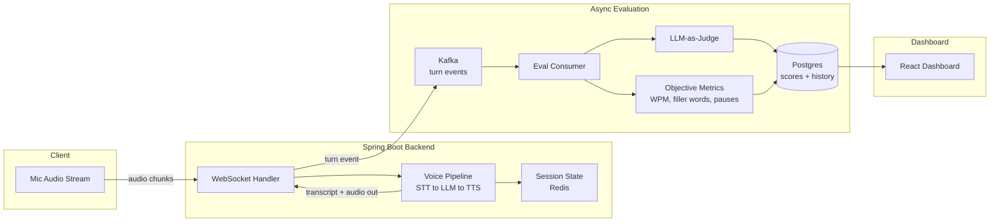

# CadenceAI

A real-time voice agent that listens to you practice out loud — explaining a concept, rehearsing a pitch, walking through reasoning — and evaluates your performance across sessions so you can track improvement over time.

> Status: early build — voice loop and evaluation pipeline in progress. Follow the build-in-public series on [LinkedIn].

## Why

Most voice AI demos show off the *assistant* answering well. CadenceAI flips that: the interesting output isn't the AI's response quality, it's a structured, trackable score of **your** performance — clarity, structure, pacing, filler words — derived from what you said.

## Architecture



**Flow:**
1. Audio streams from the client over a WebSocket into the Spring Boot backend.
2. The voice pipeline (STT → Gemini → TTS) drives the conversation in real time; session context lives in Redis.
3. Every turn is published to Kafka as an event — decoupling the real-time loop from evaluation so scoring never adds latency to the conversation.
4. An async consumer scores each session on objective transcript metrics (words per minute, filler word rate, pause patterns) and an LLM-as-judge pass on structure/clarity.
5. Scores persist to Postgres and surface in a React dashboard, with trends tracked across sessions.

## Stack

| Layer | Choice |
|---|---|
| Backend | Spring Boot (WebSocket) |
| Voice pipeline | Streaming STT + Gemini API + streaming TTS |
| Event backbone | Kafka |
| Session state | Redis |
| Eval storage | Postgres |
| Dashboard | React |

## Roadmap

- [ ] Phase 1 — Core voice loop (audio round-trip working end-to-end)
- [ ] Phase 2 — Multi-turn conversation state + Kafka event logging
- [ ] Phase 3 — Evaluation pipeline (objective metrics + LLM-as-judge)
- [ ] Phase 4 — Dashboard + demo polish

## Running locally

```bash
./mvnw spring-boot:run
```

Requires API keys for your chosen STT/LLM/TTS providers — see `application.yml.example`.

## License
